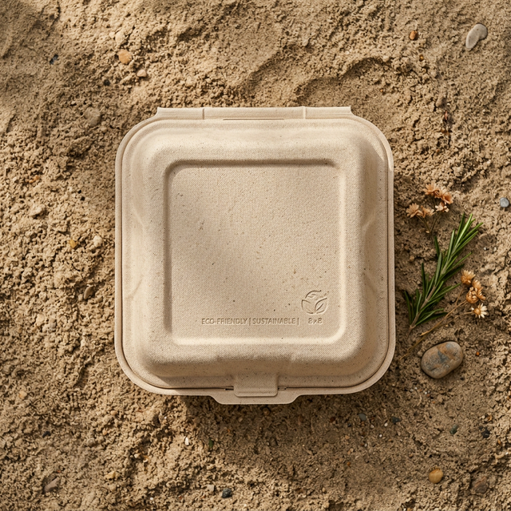

# Prithvi Essentials

 <!-- Update with your actual OG image or banner -->

**Prithvi Essentials** is a premium e-commerce landing page crafted for an eco-friendly packaging brand. Designed to provide a highly interactive, tactile, and professional user experience, the project combines modern web technologies with fluid, physics-based animations.

## ✨ Key Features

This project incorporates state-of-the-art frontend techniques to deliver a high-end feel:

*   **Dynamic Scroll Reveal Hero (`HeroMaskReveal.jsx`)**: A visually striking entry point featuring scroll-driven animations built with `framer-motion`. As the user scrolls, a massive typographic mask scales out to reveal deeply textured nature imagery, smoothly transitioning the UI from dark terracotta to clean white.
*   **Sticky Parallax Editorial (`ProductEditorial.jsx`)**: Powered by `gsap` and `ScrollTrigger`, this section pins the descriptive text while allowing massive product images to scroll by with a parallax effect. Images reveal vibrant, full color from a sophisticated sepia/grayscale base upon hover.
*   **Magnetic Custom Cursor (`MagneticCursor.jsx`)**: A custom-built, physics-based cursor utilizing `framer-motion`'s `useSpring`. It intelligently reacts to interactive elements, utilizing mix-blend modes (`difference`) and scaling up with a "View" prompt when hovering over products.
*   **Smooth Cinematic Scrolling (`LenisWrapper.jsx`)**: Integrates `@studio-freight/react-lenis` to hijack native scrolling, replacing it with a buttery smooth, customized scroll experience that perfectly complements the GSAP and Framer animations.
*   **Design Typography (`Typography.jsx`)**: A custom design system incorporating elegant serif headers for a premium, artisanal aesthetic paired with strict uppercase sans-serif spec tags.

## 🛠️ Tech Stack

*   **Framework**: Next.js 15 (App Router)
*   **Styling**: Tailwind CSS v4 & PostCSS
*   **Animations (Math & Springs)**: Framer Motion
*   **Animations (Scroll Sequencing)**: GSAP & ScrollTrigger
*   **Smooth Scroll**: Studio Freight React Lenis
*   **Icons**: Lucide React

## 📦 Project Structure

```text
├── src/
│   ├── app/
│   │   ├── page.jsx                # Main landing assembly (Hero, Editorial, Footer)
│   │   ├── layout.jsx              # Global layouts, cursors, and font setups
│   │   └── globals.css             # Global Tailwind imports & custom variables
│   ├── components/
│   │   ├── HeroMaskReveal.jsx      # Scroll-scaling mask animation
│   │   ├── ProductEditorial.jsx    # Sticky scroll & parallax products
│   │   ├── MagneticCursor.jsx      # Physics-based custom cursor
│   │   ├── LenisWrapper.jsx        # Smooth scroll provider
│   │   ├── Typography.jsx          # Reusable text components
│   │   └── Footer.jsx              # Site footer
├── public/                         # Static assets (images, logos)
```

## 🚀 Getting Started

To run the development server locally:

1.  **Clone the repository** (if you haven't already).
2.  **Install dependencies**:
    ```bash
    npm install
    ```
    *or*
    ```bash
    yarn install
    ```
3.  **Run the development server**:
    ```bash
    npm run dev
    ```
    *or*
    ```bash
    yarn dev
    ```
4.  Open [http://localhost:3000](http://localhost:3000) with your browser to see the result.

## 🌿 The UX/UI Approach

The interface avoids traditional, cheap "green" aesthetics in favor of a **premium, editorial** look. It emphasizes the tactile quality of the 100% compostable sugarcane pulp and virgin kraft paper products. By heavily utilizing scroll micro-interactions and dark, lush green/terracotta palettes that transition into clean whites, the site effectively frames the eco-friendly products as high-end, essential goods.

---

*Designed and engineered for a seamless, ultra-sharp viewing experience.*
